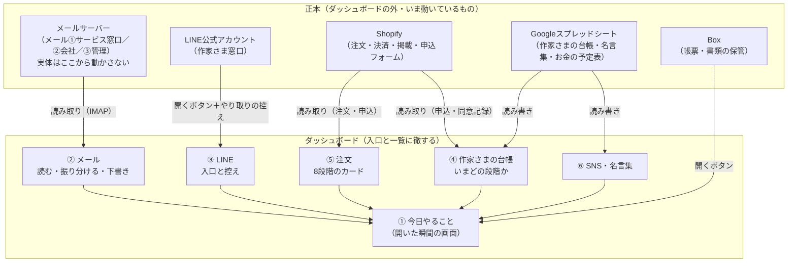

# 社内ダッシュボード 全体設計書（2026-08-06・営業戦略T・第1版）

**★これは設計書であり、コードは1行も書いていない**（実装はOpusのターミナルが担う前提の切り分け＝`04_実装の順番.md`）。
**★このリポジトリはPublicのため、個人名・メールアドレス・料率・非公開URLは書いていない。**
実名との対応表はVault `_設計_社内ダッシュボード_20260806_ATSPECT.md` にある。

---

## 0. 一番大事にしたこと（設計の物差し）

使う4人（代表・メンバーA・メンバーB・メンバーC）は**PC作業が特別に得意なわけではない**。だから：

1. **開いた瞬間に「今日やること」が見える。** 探させない。メニューを覚えさせない。
2. **ダッシュボードは「入口と一覧」に徹する。** メールの実体・決済・作家データの正本は
   **すべてダッシュボードの外**（いま動いている仕組みの中）に置いたまま動かさない。
3. **ダッシュボードが落ちても、業務は止まらない。** メールはメールサーバーに、注文はShopifyに、
   台帳はスプレッドシートに残っているので、最悪「いつもの画面を直接開く」に戻れる。
4. **迷ったら足さない。** 機能を足すか迷うものは第3段（9月以降）へ送る。第1段は薄く確実に。

---

## 1. 使う人と、主にやること（実名はVault側）

| 呼び方 | 主にやること（想定・確定ではない） |
|---|---|
| 代表 | 全体の確認・作家さまへの最終返信・入金と決済の確認 |
| メンバーA | SNS・名言集（ウィークリー・エピグラフ）の蓄積と切り替え |
| メンバーB | メールの一次確認・台帳の更新 |
| メンバーC | メールの一次確認・注文の進み具合の確認 |

★**誰が何を担当するかの正式な割り振りは代表の判断**。ダッシュボードは「誰でもどの画面も開ける・
やった操作に名前が残る」形にして、**担当割りを後から変えても作り直しが要らない**ようにする。

---

## 2. 6つの構成と、その繋がり（1枚の図）

**★矢印の向きが設計の要**＝ダッシュボードは外の正本を**読んで一覧にする**のが基本。
書き込むのは「台帳・名言集・控え・誰がやったかの記録」だけ。
**メールの送受信そのもの・決済・作家データの正本は自作しない**（確定要件どおり）。

---

## 3. データがどこに住むか（正本の一覧）

| データ | 正本の住まい | ダッシュボードは何をするか | ダッシュボードが壊れたら |
|---|---|---|---|
| メールの実体 | メールサーバー（3アカウントとも**IMAP**＝2026-08-01実測済み） | 読み取って一覧・要約・下書きを作る。**削除や送信の実体はメール側** | いつものメール画面（Webメール）を直接開けば全部ある |
| LINEのやり取り | LINE公式アカウント | 「開く」ボタンと、対応の控え（誰がいつ返したか） | LINEを直接開けば全部ある |
| 注文・決済 | Shopify | 読み取って8段階カードにする。追加のメモ（見積・手配の記録）は台帳側に持つ | Shopify管理画面を直接開けば全部ある |
| 作家さまの台帳（申込→入金→素材→原稿→公開のご確認→公開→月額） | **Googleスプレッドシート（新設・これが正本）** | 画面から読み書き。スプレッドシートを直接開いても同じものが見える | スプレッドシートを直接開いて続きができる |
| 同意記録（規約本文のSHA-256） | ★**実測待ち**＝申込フォームの送信内容がどこに残るか（通知メールの実物をシステム開発Tがまだ見ていない・2026-08-06時点） | 台帳の1人1行に「同意記録の照合」欄を紐づける | — |
| 名言集（ウィークリー・エピグラフ） | Googleスプレッドシート（名言集シート） | メンバーAが蓄積・週ごとの切り替えを画面から行う | スプレッドシートを直接開いて続きができる |
| 書類（領収書等） | Box | 「開く」ボタン＋（第3段）雛形からの出力 | Boxを直接開けば全部ある |
| 誰が何をしたかの記録 | ダッシュボード内（唯一の自前データ） | 画面の操作に名前と日時を自動で付ける | 消えても業務データは無事（記録だけの損失） |

---

## 4. ①「今日やること」に自動で並ぶもの（出どころつき）

| 並ぶもの | 出どころ | 第何段から |
|---|---|---|
| 未返信のメール（要対応だけ。セールス・スパムは出さない） | メール読み取り＋自動仕分け | 第2段 |
| LINEの返事待ち | LINE対応の控え（人が「返事待ち」を付ける） | 第1段（手動）→第3段（自動化検討） |
| 入金の確認（毎週金曜） | お金の予定表シート＋Shopify読み取り | 第1段（手動）→第2段（自動） |
| 原稿が止まっている方（何日止まっているか） | 作家さまの台帳（日付から自動計算） | 第1段 |
| 約束の期限 | 台帳・注文カードの期限欄 | 第1段 |
| 月額の稼働数・今週の入金予定 | Shopify読み取り＋お金の予定表 | 第2段 |

---

## 5. 守りの設計（最初から入れておくもの）

1. **ログインで守る**（作家さまの個人情報が入るため）。方式は `03_技術構成の提案.md` の2案。
2. **パスワード類は平文で置かない**＝サーバーの環境変数（.env）と暗号化保管。
   LINEのパスワードは「4人の画面から使える・ただし平文でファイルに置かない・表示した記録が残る」形（03参照）。
3. **操作に名前が残る**＝返信した・段階を進めた・名言を切り替えた、に「誰が・いつ」を自動で付ける。
4. **消す操作は置かない**＝第1段〜第2段のダッシュボードに「削除」ボタンを作らない
   （間違って消す事故を構造的に防ぐ。消すのは正本側の画面でだけ行う）。
5. **バックアップ**＝台帳スプレッドシートは日次でコピーを自動保存（Google側の版履歴＋週1でBoxへ書き出し）。

---

## 6. ★実測待ち（推測で確定させていない箇所）

| # | 実測待ちの内容 | 誰の実測を待つか | 設計のどこが変わりうるか |
|---|---|---|---|
| 待1 | **申込フォームの通知メールの実物**（同意記録・SHA-256がどう届くか） | システム開発T（8/6時点で「通知メールの実物も見ていない」と明記） | ④台帳の「同意記録の照合」欄の作り方 |
| 待2 | **注文の通知**（Shopifyからどんな形で来るか・KOMOJU側の通知） | システム開発T | ⑤注文カードへの自動取り込み方法 |
| 待3 | **メール3アカウントの実物**（フォルダ構成・迷惑メールの割合・1日の通数） | システム開発T | ②メールの仕分けルールと画面の作り |
| 待4 | LINE公式アカウントの複数人利用の仕様（同時ログイン可否・権限） | 未定 | ③LINEの入口の作り（公式の複数人機能を使えるなら控え欄が簡素になる） |
| 待5 | 作品の寸法・重さのデータがどこまで揃っているか | リサーチT／システム開発T | ⑤見積の半自動化（第3段）の精度 |

---

## 7. 決めていないこと（司令塔判断待ち・両案併記）

- **技術の置き場所（案A：小さな専用サーバー1台／案B：スプレッドシート中心＋薄い画面）**＝`03_技術構成の提案.md`
- **ログインの方式（案ア：メールに届く確認コード／案イ：ID＋パスワード）**＝同上
- 担当割りの正式決定（§1）＝代表判断

<!-- created: 2026-08-06 by terminal=あつぺくと営業戦略 model=Fable 5 work=社内ダッシュボード設計 -->
