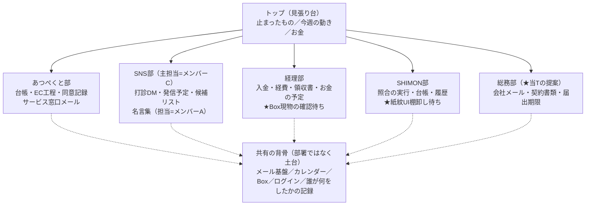

# 部署制ダッシュボード 全体設計 v2（2026-08-06・営業戦略T・第3便）

**軸の転換（代表指示）＝「機能で切る」から「部署で切る」へ。**
第1便（01〜05）・第2便（06）の設計を部署軸で再構成した。**コードは書いていない。**
★個人名はVault対応表の呼び方（メンバーA／B／C）で書く。金額の内部基準・非公開URLは書いていない。

---

## 0. 設計の思想（v2で最上位に置くもの）

**「全てのことは回せない」＝部署の中が回っている限り、代表はトップだけ見ればよい。
止まったときだけ、トップに上がってくる。**

- トップは「会社全体の見張り台」＝**止まったもの・今週の動き・お金**だけ。順調なものは出ない。
- 部署の中は「その仕事の道具箱」＝その部署のメール・予定・保管フォルダ・固有の道具が1画面に揃う。
- 初心者4人が迷わない、は最上位のまま（ボタン文言・削除ボタンなし・「いつもの画面を開く」の逃げ道は全部継承）。

---

## 1. 部署の構成（代表案＋当Tの提案1つ）



### ★提案＝「総務部」を1つだけ足す（★両案併記・確定は司令塔）

理由＝メール3系統のうち、**会社メール（②）と管理メール（③）の住まいが4部署のどこにも無い**。
契約書類・法的文書の版・登記や届出の期限も置き場が要る。

- **案a：総務部を作る**（会社メール2系統・契約書類のBoxフォルダ・届出期限のカレンダー）。部署は計5つ。
- **案b：部署は4つのまま、トップに小さな「会社のこと」箱を置く**（メール2系統と期限だけ）。
- ★推し＝**案a**（「部署に入れば全部ある」という代表の思想に合う。箱が増えるのは1つだけ）。
- ★これ以外の部署は**足さない**（増やしすぎない）。名言集は独立部にせずSNS部の中の持ち場とした。

### 持ち場（確定要件どおり）

- SNS部の主担当＝**メンバーC**／名言集の担当＝**メンバーA**。
- **担当列は空欄でも動く**（担当が未定でも仕事は進む。担当の正式決定は代表）。

---

## 2. トップ画面（見張り台）— ラフ

```
┌─ あつぺくと ホーム（8月6日 水曜日） ─────────────────────┐
│ [あつぺくと部] [SNS部] [経理部] [SHIMON部] [総務部]   ○○さん │
│──────────────────────────────────────────────│
│ ■ 止まっています（部署をまたいで、ここにだけ上がってくる）      │
│   □ あつぺくと部：〔お名前〕さま 素材の段階で14日 [部へ行く]    │
│   □ 経理部：金曜の入金確認が1件残っています      [部へ行く]    │
│   ※0件のときは「いま止まっているものはありません」と出る        │
│                                                            │
│ ■ 今週の動き（台帳・注文・予定から自動）                       │
│   ・あたらしいお申し込み〔件数〕／段階がすすんだ方〔件数〕        │
│   ・注文の動き〔件数〕／SNSの投稿〔件数〕                      │
│   ・今週の約束：〔金曜=入金確認〕〔公募展の会期…〕              │
│                                                            │
│ ■ お金                                                     │
│   ・金曜の入金確認：〔件数〕件  ・月額の稼働：〔件数〕件         │
│   ・次の入金予定日：〔8月14日〕（Shopifyの支払い予定より）       │
│                                                            │
│ [今週の振り返り1枚をつくる]（金曜は自動でできています）           │
└──────────────────────────────────────────────┘
```

- **部署の中で順調に回っているものは、トップに一切出ない。**
- 「今日やること」の細かい行（メール1通ずつ等）は**各部署の中**に移った（v1からの変更点）。
  トップに出るのは**「止まった」判定に達したものだけ**。

### ★「止まった」とみなす基準（1枚の表で持つ・代表が数字を直せる）

**基準日数は台帳スプレッドシートの「基準の表」タブに置き、画面はそこを読むだけ**にする
（数字を変えるのに実装のやり直しが要らない）。**★初期値はすべて当Tの仮置き＝実測にもとづかない。**
運用しながら代表が直す前提（第1段実装の「一律7日」を部署別・段階別に細分化した）。

| 部署 | 何が | 止まったとみなす初期値（★仮置き） |
|---|---|---|
| あつぺくと部 | 要対応メールが未返信 | 2営業日 |
| あつぺくと部 | 台帳の段階が動かない | 素材まち14日／原稿7日／公開のご確認7日／その他7日 |
| あつぺくと部 | EC工程の段階が動かない | ②作家さま確認2日／④ご連絡後のお返事14日／その他7日 |
| 経理部 | 金曜の入金確認が未完 | 金曜の終業時点で残っていれば即 |
| SNS部 | 予定日を過ぎた投稿 | 当日中に済みでなければ翌朝 |
| 全部署 | カレンダーの約束の期限 | 超過で即（期限7日前から「近い」表示） |

---

## 3. 各部署の中 — ラフ（共通の型＝上から「止まっている・メール・予定・道具・保管」）

**全部署が同じ並び順**にする（どの部に入っても画面の作りが同じ＝迷わない）。

### 3-1. あつぺくと部

```
┌─ あつぺくと部 ────────────────────────────────┐
│ ■ この部で止まっているもの（基準の表による）                │
│ ■ メール（サービス窓口）：お返事が要るもの〔件数〕 [読む]     │
│ ■ この部の予定：〔作家さまとの約束・公開予定…〕              │
│ ■ 道具                                                  │
│   [作家さまの台帳]（7段階・同意記録の照合つき）             │
│   [注文]（8段階カード・見積の電卓）                        │
│ ■ 保管：[Boxのあつぺくとフォルダを開く]                    │
└────────────────────────────────────────────┘
```

- 台帳・EC・同意照合・見積電卓・定型文3本＝**第1〜2便の設計のまま、この部の道具になる**（中身の変更なし）。
- 同意記録＝**実測で「通知メール1通の中にしか無い」ことが確定済み**（システム開発T 8/6実測）。
  台帳の照合列と、メールPDFのBox保存手順（同T作成済み）をこの部に紐づける。恒久対策＝第2段（★待1の残り＝メール実物）。

### 3-2. SNS部（主担当=メンバーC／名言集=メンバーA）

```
│ ■ この部で止まっているもの                                 │
│ ■ この部の予定：〔投稿予定・打診の予定〕                    │
│ ■ 道具                                                  │
│   [打診の候補リスト]（★正本はこのリスト。台帳へ渡すまで）     │
│   [発信の予定と管理]                                      │
│   [名言集]（蓄える・来週のことばを選ぶ＝担当メンバーA）       │
│ ■ 保管：[BoxのSNSフォルダを開く]                          │
```

**★部署をまたぐ受け渡し（二重入力なし）**＝候補リストの行に「**あつぺくと部へ渡す**」ボタン。
押すと台帳に下書き行ができ、候補リスト側は「渡し済み（正本は台帳）」と表示が変わり編集できなくなる。
**同じ情報を2か所に書かない＝正本がどちらかを画面が常に示す**（渡す前=候補リスト／渡した後=台帳）。

### 3-3. 経理部（★Boxの既存シートの現物確認待ち＝待6）

```
│ ■ この部で止まっているもの（金曜の入金確認 等）              │
│ ■ メール（管理）：お返事が要るもの〔件数〕 [読む]  ※置き場は総務部案と両にらみ │
│ ■ この部の予定：〔金曜=入金確認・月額請求日・支払期限〕       │
│ ■ 道具                                                  │
│   [入金の確認]（Shopifyの支払い画面へ＋確認の記録）          │
│   [お金の予定表]                                          │
│   [領収書の読み取り]（★第3段・Box現物の確認後に設計）        │
│ ■ 保管：[Boxの経理フォルダを開く]                          │
```

★**経理正本Excelは閲覧のみ**（全社ルール）＝この部の道具はすべて「読む・別紙に記録する」で設計し、
正本を書き換える機能は作らない。**既存Boxシートとの役割分担は現物確認（待6）まで確定させない。**

### 3-4. SHIMON部（★紙紋UIの棚卸し報告待ち＝待7）

```
│ ■ この部で止まっているもの                                 │
│ ■ この部の予定                                            │
│ ■ 道具：[照合を実行] [照合の台帳] [これまでの履歴]           │
│ ■ 保管：[BoxのSHIMONフォルダを開く]                        │
```

★**中身の設計は棚卸し報告（待7）が届くまで骨のみ**。ここに置くのは「入口が同じ型で存在する」ことだけ。

### 3-5. 総務部（案aのとき）

```
│ ■ この部で止まっているもの（届出・契約の期限）               │
│ ■ メール（会社）／メール（管理）：お返事が要るもの [読む]      │
│ ■ この部の予定：〔届出期限・契約更新日〕                     │
│ ■ 道具：[契約書類の一覧]（正本の版がどれかを明示）            │
│ ■ 保管：[Boxの総務フォルダを開く]                           │
```

---

## 4. 共有の背骨（部署ごとに作らない・1つを共用）

| 背骨 | 1つの仕組み | 部署からはどう見えるか |
|---|---|---|
| メール基盤 | IMAP読み取り＋AI要約・下書き（第2段・v1の②の設計のまま） | **宛先で部署に振り分ける**＝サービス窓口→あつぺくと部／会社・管理→総務部（案b なら経理部と分担）。仕分けの器は1つ |
| カレンダー | ★両案（下記） | 各部署は「自分の部の予定」だけが絞られて見える。トップは全部署の今週分 |
| Box | 既存のBox | 部署ごとのフォルダへの「開く」ボタン。★フォルダ実在は未確認のまま設計（勝手に作らない） |
| ログイン | 4人個別（v1の案ア/案イ＝確定待ちのまま） | 全画面共通で1回 |
| 誰が何をしたかの記録 | 1つの記録簿 | 全部署の操作が「誰が・いつ・どの部で」の形で残る |

### ★カレンダー（両案併記・確定は司令塔）

- **案I：Googleカレンダーを1つ作って共用**（ダッシュボードは読むだけ・「いつもの画面を開く」の逃げ道あり）。
  費用0円・4人のスマホからも見える。★推し。
- **案II：ダッシュボード内に自前の予定表**（外部依存なし・ただし自作が増える＝「自作を最小に」に反する）。
- **予定の入力＝当面は代表のみ**（他3人は見るだけ）。広げるのは設定1つで済む形にする
  （狭く始めて広げる。指示どおり）。

---

## 5. ★既存の第1段実装への影響＝**作り直しは不要。載せ替えで済む**（実測にもとづく判定）

システム開発Tの第1段実装（本日・`atspect-system/dashboard/`）を実測記録で確認した：
**画面2枚（トップ・台帳）＋設定ファイル＋台帳JSON**という小さな構成で、読むだけ・削除なし。

| 既存物 | v2でどうなるか | 作業量の見立て |
|---|---|---|
| `daicho.html`（台帳・同意照合） | **無変更**＝「あつぺくと部」の道具としてそのまま使う | 置き場所（リンク）の変更のみ |
| `index.html`（今日やること＋6入口） | **1枚だけ組み替え**＝上の帯を6機能→5部署に、本文を「止まった・今週の動き・お金」の3欄に | このファイルのみ書き直し |
| `assets/config.js`（行き先・照合値・段階定義） | 行き先を部署別に増やす＋**「基準の表」の読み込み先を足す** | 追記のみ |
| `assets/app.js`（読むだけ） | 「今日やること」の拾い口を**部署の配列**にする（将来、経理・SNSのデータ元が増えても拾い口を足すだけ） | 小改修 |
| `data/ledger.json`（台帳） | **無変更**（台帳はあつぺくと部固有のデータ。部署列は不要） | なし |
| 部署ページ（SNS・経理・SHIMON・総務） | **新規だが「骨」だけ**＝§3の共通型で入口とBoxリンクのみ | 型1つ×4枚 |

**★最小の道筋＝「index.html 1枚の組み替え＋骨ページ4枚の追加」。台帳・照合・データは触らない。**
第1段の成果（390px横溢れ是正・照合3状態・見本データ）はすべてそのまま生きる。

---

## 6. 「もっと強力な運用管理」への提案（採否＝司令塔・代表）

1. **止まりの自動検知**＝§2の「基準の表」方式（数字は表で直す・実装をやり直さない）。
   検知はトップに**上げるだけ**で、自動で催促メールは送らない（「追わない」の営業方針と、誤送信の防止）。
2. **部署またぎの受け渡し**＝§3-2の「渡す」ボタン方式（正本の移動を画面が明示・二重入力なし）。
3. **週次の振り返り1枚**＝毎週金曜に自動で1枚（A4）：あたらしいお申し込み／段階がすすんだ方／
   入金の件数／注文の動き／SNSの投稿／止まったものとその日数／来週の約束。
   **数字は台帳・注文・記録簿から自動集計**（手で数えない）。3人の打ち合わせにそのまま使える。
   ★紙にする前に必ずレンダリング画像を目視（visual-first-check）を実装時の受け入れ条件にする。
4. **記録の一元性**＝すべての一覧画面の右上に小さく「**正本：〔スプレッドシート／Shopify／メール〕**」と表示。
   同じ情報を2か所に書く画面を作らない（渡す前後で正本が移るものは§3-2の方式で明示）。
5. **権限の将来形**＝いまは4人全員が全部見える。ただし記録簿と設定に**「部署の見える範囲」欄を最初から持たせる**
   （全員=全部ON で開始）。人が増えたとき、設定を1つ変えるだけで部署単位に絞れる。**画面の作り直しはしない。**

---

## 7. 実装の切り分け（更新版）

| 段 | 内容 | 備考 |
|---|---|---|
| **第1段（今週・更新）** | §5の載せ替え（トップ組み替え＋骨4枚）／あつぺくと部に台帳・EC電卓・定型文を束ねる／基準の表（仮置き値）／ログイン（案ア/イ確定後） | 既存実装の上に足す。**作り直し無し** |
| 第2段（8月中） | メール統合（宛先→部署振り分け）／注文カード自動下書き／カレンダー統合（案I/II確定後）／週次1枚の自動生成／SNS部の候補リスト＋「渡す」ボタン | ★待1残り・待2・待3の実測後 |
| 第3段（9月以降) | 経理部の道具（領収書読み取り＝**待6の現物確認後**）／SHIMON部の道具（**待7の棚卸し後**）／見積の帯引き全自動・来歴カードPDF／権限の部署絞りの実運用 | |

## 8. ★実測待ち一覧（v2で追加分を含む・揃ったら埋まる形）

| # | 待っているもの | 状態 |
|---|---|---|
| 待1 | 同意記録の通知メール**実物** | **所在は確定済み**（メール1通のみ＝8/6実測）。**中身は未読**（webmailログインが必要＝代表の操作） |
| 待2 | 注文通知の形 | 未実測（注文タイムラインの「メールを表示」で見られる可能性あり＝システム開発T申し送り） |
| 待3 | メール3アカウントの実物（フォルダ・通数） | 未実測（同上） |
| 待4 | LINE公式の複数人利用の仕様 | 未実測 |
| 待5 | 作品の寸法・重さのデータ | 寸法あり・重さ無し（8/6実測・第2便） |
| **待6** | **経理のBox既存シートの現物** | **未確認**（経理部の道具はこれまで骨のみ） |
| **待7** | **SHIMONの紙紋UI棚卸し報告** | **未着**（SHIMON部は骨のみ) |

## 9. ★判断が割れる点のまとめ（両案併記で司令塔に返す）

1. **総務部を作るか**＝案a（作る・推し）／案b（トップに「会社のこと」箱）→ §1
2. **カレンダー**＝案I（Google共用・推し）／案II（自前）→ §4
3. 第1〜2便からの持ち越し（未確定のまま）＝ホスティング案A/B・ログイン案ア/イ・運賃表案1/2・重さ案あ/い・来歴カード2言語案

<!-- created: 2026-08-06 by terminal=あつぺくと営業戦略 model=Fable 5 work=部署制ダッシュボード設計v2 -->
